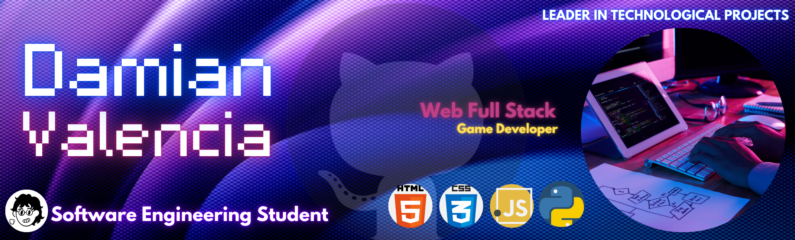

#  Hello guys! My name is Damian,
I'm 19, and as a proud Software Engineering student at the School of Facultad de Ingeniería Electromecánica, , I’m driven by a vision of blending creativity, strategic organization, and cutting-edge technology to craft solutions that make a lasting impact. 💡✨

✨ I'm passionate about creating innovative solutions that make a difference.  
🔭 Currently working on: **[Damian's Portfolio](https://github.com/Dami-Val/Damian-s-Portfolio.git)**  
🎮  Last proyect: **[AnimalBots Rescue](https://github.com/Dami-Val/AnimalBots-Rescue)**  

---

### 🚀 **Skills & Tools**

- 💻 Languajes:      
- 🤖 AI Development | 📚 Project Management
- ⭐ Project Management: Successfully leading multidisciplinary teams and delivering high-quality products on time ⏳.
- 🎨 Creativity and Design: Developing interactive experiences with an emphasis on visual storytelling and details ✨🎭.

  

| 👀 Current Focus |  |
|------------------------------------------------------------------------------------------------------|---------------------------------------------------------------------------------------------------------------------------|
| 🔹 **Focused on Web Design Excellence 🌐💻:**   I’m exploring the world of web design, channeling my technical and creative skills to craft user-centered and visually engaging interfaces that prioritize functionality and beauty. |                                                                                                                            |

## 📈 GitHub Stats 

---

### 📊 Stats & Languages  

  <tr>
    <td align="center"></td>
    <td align="center"></td>
  </tr>

---

### 🚀 Activity & Achievements

  <tr>
    <td align="center"></td>
    <td align="center"></td>
  </tr>

---

### 🎯 My Mission 
To grow as a developer, collaborate on innovative projects, and leave a meaningful mark in the tech world.
 
 
---

### 📫 **Contact Me**
📢 Let’s Connect! Whether it’s video games, web design, or cutting-edge software, I’m excited to collaborate and create something extraordinary. 🤝💻

         

